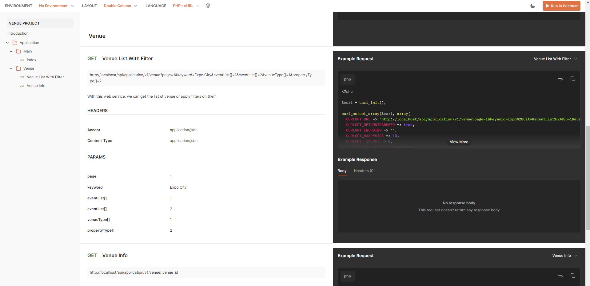
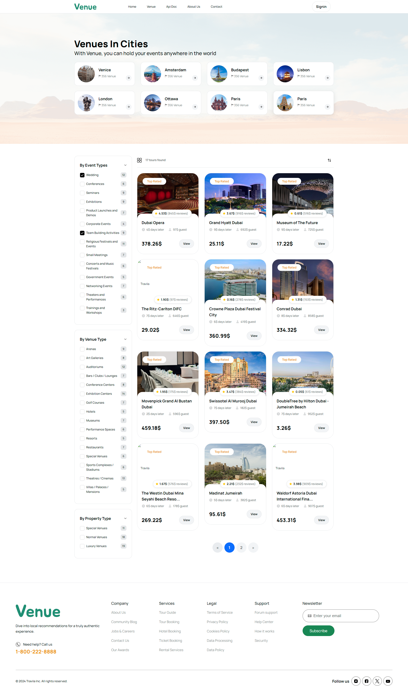

# Venue

This project was created at the request of Mr Kaveh Technology company for my testing purposes. I used last Laravel and Sail in this project to make it easily testable in an isolated Docker environment.

First, get the project from Git

Then run the following commands in the project path

* Make sure Docker is up to date on your system


## Installation

Install Venue project

```bash
  cd my-project

  composer install

  cp .env.example .env

  php artisan key:generate

  ./vendor/bin/sail up -d
```


Wait for your Docker to install then

```bash
  ./vendor/bin/sail artisan migrate --seed
```


I have prepared the project documentation in Postman for you to use if needed.

[Documentation](https://documenter.getpostman.com/view/1976063/2sA3kaAyNx)





Demo:


## Support

For support, email meysamhosseini1995@gmail.com or join our Slack channel.